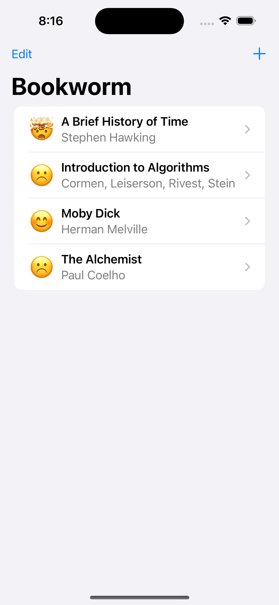
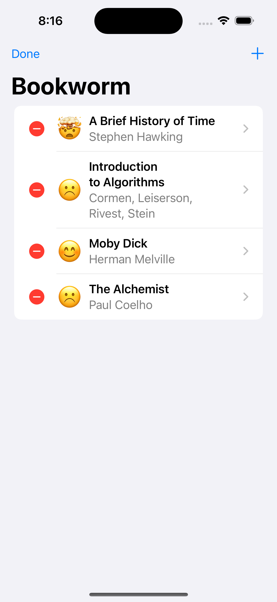
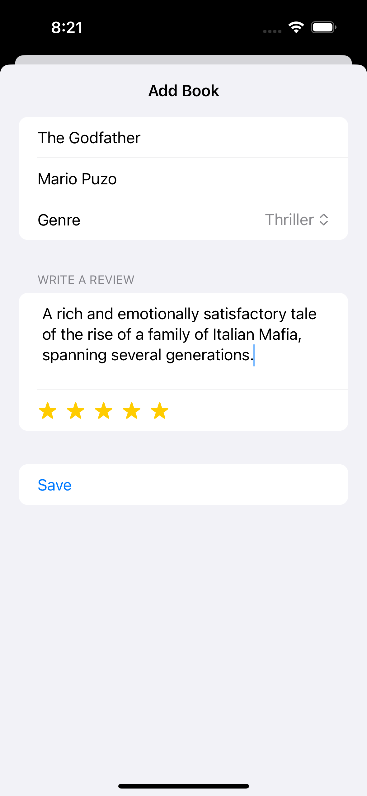
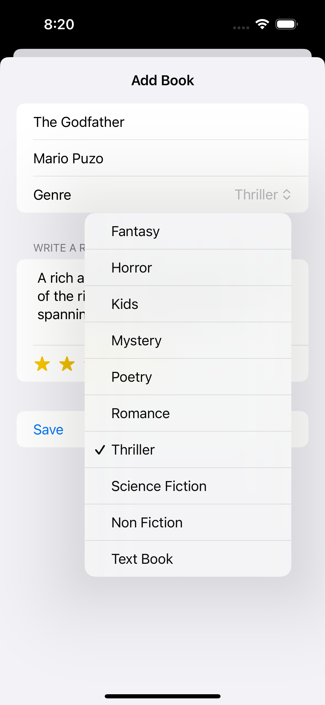

# Bookworm

Bookworm is a SwiftUI application that allows users to manage and review their favorite books. Users can add new books, view detailed information, and rate each book using an intuitive interface.

## Features

- **Add Books**: Easily add new books with details such as title, author, genre, review, and rating.
- **View Details**: Access detailed information about each book, including genre images and user reviews.
- **Rating System**: Rate books using a star-based system with corresponding emoji representations.
- **Edit and Delete**: Manage your book collection by editing or deleting entries.
- **Sort and Search**: Sort books by title and author for easy navigation.
- **User-Friendly Interface**: Navigate seamlessly through a clean and responsive SwiftUI interface.

## Screenshots

<div style = "display: flex; justify-content: space-around; align-items: center; flex-wrap: wrap; flrex-gap: 20px; row-gap: 20px;">
    
    
    
    
</div>

## Installation

1. **Clone the Repository**

    ```bash
    git clone https://github.com/yourusername/bookworm.git
    ```

2. **Open in Xcode**

    ```bash
    cd bookworm
    open Bookworm.xcodeproj
    ```

3. **Build and Run**
    - Select the desired simulator or device.
    - Click the Run button in Xcode.

## Usage

- **Add a Book**: Tap the "+" button, fill in the book details, and save.
- **View Book Details**: Tap on a book from the list to see more information.
- **Delete a Book**: Swipe left on a book in the list and confirm deletion.
- **Edit a Book**: Implement editing functionality as needed.

## Acknowledgments

- Inspired by SwiftUI tutorials and the need for a personal book tracking app.
- Thanks to the Swift community for their continuous support and resources.
